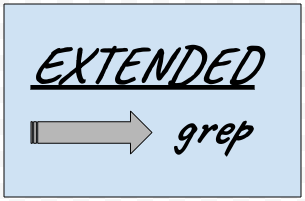
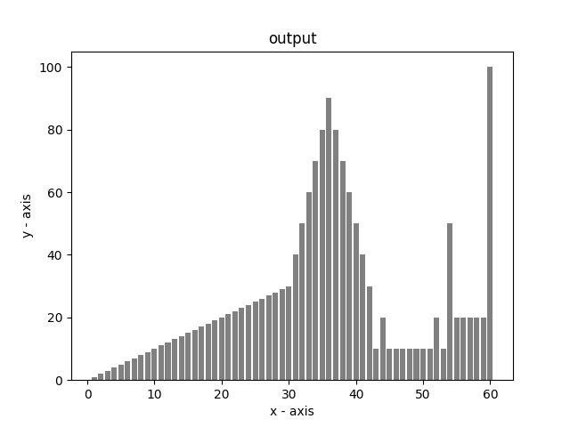

 
  

<h1 align="center"> Extended Grep </h1>
<h3 align="center"> A Tool to Extract and Visualize Data From a Log File </h3>  

 

<!-- TABLE OF CONTENTS -->
<h2 id="table-of-contents"> Table of Contents</h2>

  
Table of Contents

  <ol>
    <li><a href="#about-the-project"> ➤ About The Project</a></li>
    <li><a href="#prerequisites"> ➤ Prerequisites</a></li>
    <li><a href="#folder-structure"> ➤ Folder Structure</a></li>
    <li><a href="#arguments-details"> ➤ Arguments Details</a></li>
    <li><a href="#how-to-use"> ➤ How to Use</a></li>
    <li><a href="#limitations"> ➤ Limitations</a></li>
    <li><a href="#license"> ➤ License</a></li>
  </ol>

<!-- ABOUT THE PROJECT -->
<h2 id="about-the-project"> About The Project</h2>

 
  This project's aim is to minimize the spent time to analyze a big and complex log files and visualize numeric type data fastly.
  As a developer, I generally spent my time to analyze logs gathered from the field. Some field problems are hard to reproduce. So, logging operations could take days sometimes. More logging day means big and complex log files. I dealt with 6GB txt file once before and my editor could not open it and crashed.

  So, I decided to write this application. Because with this application, I can do the followings;

  * extracting all the lines that includes special keywords given as argument
  * extracting all the words/data in a specified line, even the numeric data is hidden in a string
  * extracing data from a table. We are doing that with "--linebelow" argument because table content is changing and we cannot specify a keyword to point out the specific line
  * seeing the line number of a line thatwe interested
  * for numeric values, we can filter the data with maximum/minimum threshold
  * we can filter the data to see only when it is changed
  * we can also eleminate duplicates with "--select"/"--from" arguments
  * graphs can be drawn for numeric data to see the trends fast

<!-- PREREQUISITES -->
<h2 id="prerequisites"> Prerequisites</h2>

  
  
  
  

No third party packets used in this project.

<!-- FOLDER STRUCTURE -->
<h2 id="folder-structure"> Folder Structure</h2>

    code
    .
    │
    ├── pictures
    │   ├── egrep.png
    │
    ├── LICENSE
    ├── main.c  
    ├── main.h    
    ├── Makefile 
    ├── README.md
    ├── test.log

* pictures folder: contains pictures used in the README.md file.
* LICENSE file: contains license information
* main.c and main.h files: are source codes
* Makefile: makefile to compile the program
* README.md file: readme itselt
* test.log file: a simple and sample log file to test the app quickly  

<!-- ARGUMENTS -->
<h2 id="arguments-details"> Arguments' Details</h2>

    

	--logfilepath     	(-f): log file path
		used to specify the log file's directory path.
		This is MANDATORY field

	--keywords        	(-k): keyword list
		used to specify special keywords to pick a line. You can use multiple keywords seperated by comma without empty space.
		This is MANDATORY field

	--seperator       	(-ps): seperator
		used to specify special character to split the picked line.
		TAB is used if it is not set

	--elementat       	(-e): element at
		used to specify which element you want to extract after splitting the line.
		If this is not used, then whole line will be filtered.

	--numerictype     	(-n): numeric type
		used to specify the extracted element's type is numeric.
		This is usefull when the extracted field contains numeric and alphanumeric characters together
		No parameter required

	--linebelow       	(-b): line below
		used to select a new line that is number of lines below the picket line before
		This is usefull when there is no constant string specifier to pick the line that we want to examine

	--showlineno      	(-l): add line no
		used to specify real line no in the log doc in the new generated file
		No parameter required

	--onlyshowchanges 	(-c): show only changes
		used to parameter changes, like "watch" property
		No parameter required

	--maxthres        	(-x): max threshold
		used to filter numeric values
		numerictype arg is used by default with this filter

	--minthres        	(-m): min threshold
		used to filter numeric values
		numerictype arg is used by default with this filter

	--select          	    : select
		used to pick "select-th" line from "from" lines
		from arg is must
		usefull to remove duplicated log lines

	--from            	    : from
		used to pick "select-th" line from "from" lines
		select arg is must
		usefull to remove duplicated log lines

	--version         	(-v): show version

	--drawgraph       	(-g): draw graph
		creates graph from the extracted data
		useful when to visualize the data
		requires argument which is file path for newly created image
		numerictype arg is used by default with this filter

<!-- HOWTO -->
<h2 id="how-to-use"> How to Use</h2>

1. First, you need to compile the program
> make clean all
2. Then, you may use the executable application on "test.log" sample file like below
> ./egrep --logfilepath test.log --keywords test1 --seperator " " --elementat 2 --minthres 200 --select 0 --from 5 --drawgraph ./

The above command's menaning is;
* use "test.log" as the input log file
* first, extract the lines includes "test1" keyword. (PS. more keywords canbe used here by seperating them with comma)
* seperate the selected lines with " " (empty space). (PS. if seperator is not specified, TAB character is used by default)
* after seperation, second word (starting from index 1) is the data that we interested
* since we know it is a numeric type, we added minimum threshold. It means, the data greater than 200 are in our scope now
* also, we want to take 0. index in each 5 lines. This gives us a ability to remove duplicates (it is not necessary in our example)
* and lastly, we want to see these extracted data on a graph and we gave folder path for the graph to be saved.

Here is the output of the execution;

    201  
    206  
    211  
    216  
    221  
    226  
    231  
    236  
    241  
    246  
    251  
    256  
    261  
    266  
    271  
    276  
    281  
    286  
    291  
    296  
    
    **********************************************************
    TOTAL PROGRESSED LINES: 300
    TOTAL EXTRACTED LINES: 300
    TOTAL SHOWED LINES: 60
    
    **********************************************************

Note that, we can use ">>" to save the output to a file.

Here is the output graph view;

 
  

<!-- LIMITS -->
<h2 id="limitations"> Limitations</h2>

All limitations are numeric and can be modified in "main.h" file.

* PIXEL_WIDTH:      Used to determine one graph column's width
* EMPTY_WIDTH:		Used to determine empty pixels between each graph column
* IMAGE_HEIGHT:     Used to limit image height
* IMAGE_MAX_WIDTH:  Used to limit image width
* ONE_LINE_MAX_LEN: Used to limit one line lenght in the log file

<!-- LICENSE -->
<h2 id="license"> License</h2>

<h3 align="left"> This project is completely FREE </h3>
